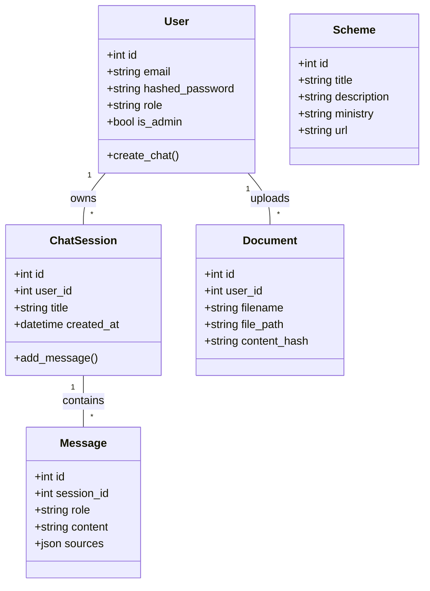
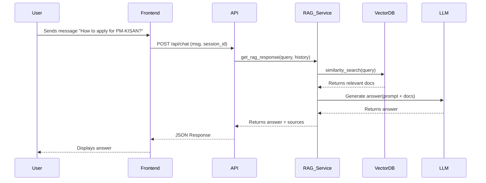
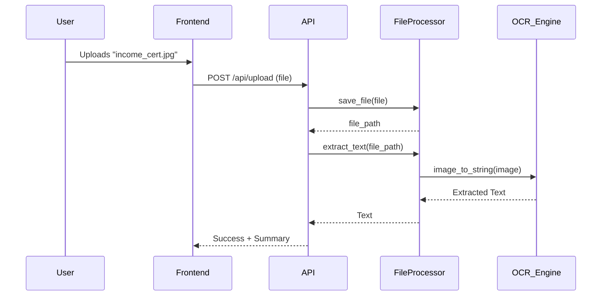
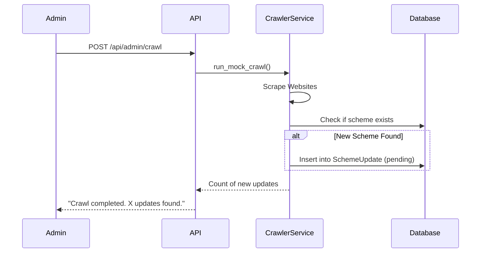

# GovAssist AI: UML Diagram Pack

## 1. Class Diagram (Simplified)



## 2. Use Case Diagram: Citizen

```mermaid
usecaseDiagram
    actor Citizen
    actor AI_Assistant

    Citizen --> (Login/Signup)
    Citizen --> (Start New Chat)
    Citizen --> (Upload Document)
    Citizen --> (Search Schemes)
    Citizen --> (View History)
    
    (Start New Chat) --> AI_Assistant : Queries
    AI_Assistant --> (Provide Answer) : Responses
    (Upload Document) --> AI_Assistant : Analysis
```

## 3. Sequence Diagram: Chat Flow



## 4. Sequence Diagram: Document Upload



## 5. Sequence Diagram: Scheme Crawler (Admin)


