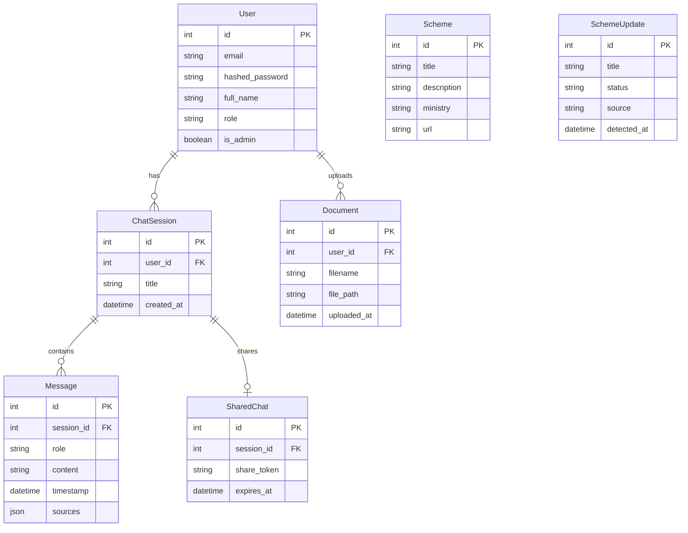

# GovAssist AI: Database Schema Manual

## Entity-Relationship Diagram (ERD)

## Table Definitions

### 1. Users
Stores user credentials and profile information.
- **Indexes**: `email` (Unique)

### 2. ChatSessions
Groups messages into conversations.
- **Foreign Key**: `user_id` -> `Users.id`

### 3. Messages
Individual chat messages.
- **Foreign Key**: `session_id` -> `ChatSessions.id`
- **Fields**: `role` (user/assistant), `content` (text), `sources` (JSON array of citations).

### 4. Documents
Metadata for uploaded files.
- **Foreign Key**: `user_id` -> `Users.id`

### 5. Schemes
Official government schemes database.
- **Indexes**: `title`, `ministry`

### 6. SchemeUpdates
Temporary holding table for crawler results awaiting admin approval.
- **Status Enum**: `pending`, `approved`, `rejected`

### 7. SharedChats
Manages public links for chat sessions.
- **Foreign Key**: `session_id` -> `ChatSessions.id`
- **Indexes**: `share_token` (Unique)
